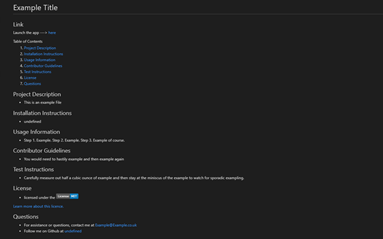

# Professional-README-generator
A simple command line application that allows you to generate a README.md file.

## Contents
Section | Description
------------ | -------------
[Deployment](#Walk-Through) | Link to a Video Walk-Through
[Technologies](#Technologies) | Technologies Used
[Installation](#Installation) | Installation Information
[Usage](#Usage) | How to use the application
[Screenshots](#Screenshots) | Screenshots of the deployed application
[Licence](#licence) | Licence for the source code
[Questions](#Questions?) | Where you can reach me

## Walk-Through
OPEN VIDEO WALK-THROUGH ---> [HERE](https://drive.google.com/file/d/1b4cG3TcNyJN-yYBaiMFcU7u-GVawT1B5/view)

## User Story

- AS A developer
- I WANT a README generator
- SO THAT I can quickly create a professional README for a new project

## Technologies
- JavaScript 

## Installation
 To run this application locally, do the following:
 - (i) Clone this repository from GitHub
- (ii) This app contains a package.json so you just need to run `npm i` from the root directory to install the relative node packages
- (iii) run `npm start` in the terminal from the root directory 

## Usage
- After running `npm start` in the terminal, inquirer will display prompts in the console that will allow you to generate a README
- A video walkthrough can be found at the top of the README 

## Languages Used
- JavaScript 

## Screenshots
An example of a readME generated by this application --->

## License

> This project was created under the standard MIT licence.

> [Learn more about this licence.](https://lbesson.mit-license.org/)

## Questions?

Please contact me through my GitHub provided below if you have any questions relating to how the application works or any of my other projects

My GitHub username is Robbie-Bridgwater

Link to my GitHub Profile ---> https://github.com/Robbie-Bridgwater
